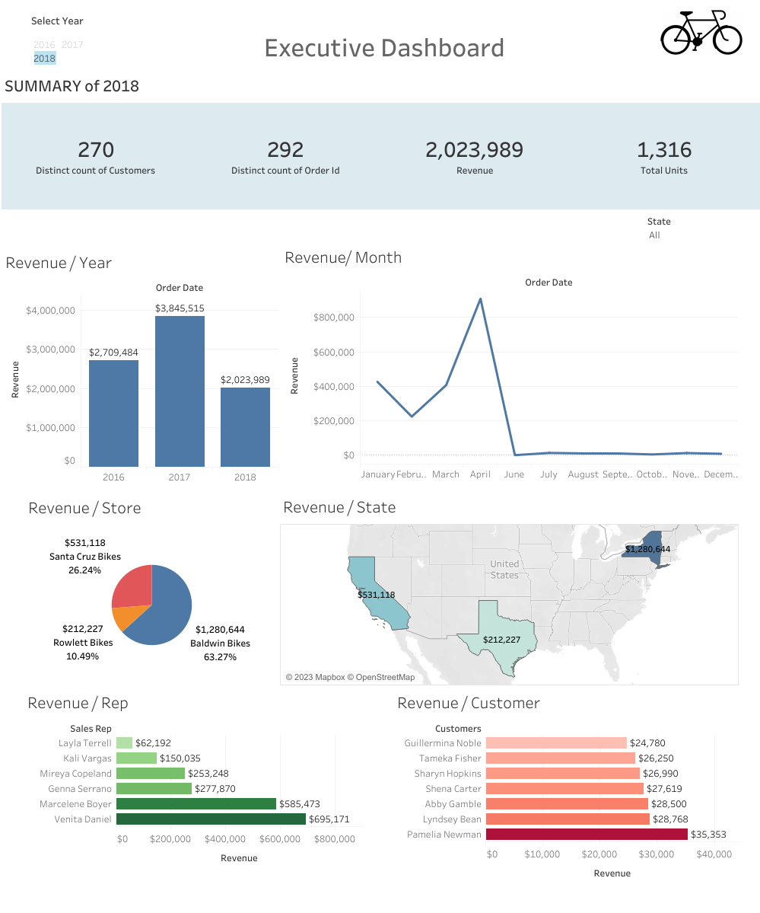

# Daniel Warner's Project Portfolio

## Contact Information

✉️ Email: warnd114@gmail.com  
🌐 LinkedIn: [Daniel Warner LinkedIN](https://www.linkedin.com/in/daniel-warner-720273238/)

## About Me
Hello! I'm Daniel Warner, a recent graduate from The University of Oregon. I am skilled in using SQL, Excel, Tableau, Python, and RStudio to complete data analytics tasks and create data visualizations. I am passionate about continuing to further my education and knowledge in the Data Science field.

Looking forward to connecting with you!

---

## Projects

### Bike Store Dashboard - Excel, SQL, Tableau
Welcome to my Bike Store Project. This project involved creating tables in Microsoft SQL, cleaning, merging, and grouping the data. Connecting SQL to Excel to create pivot tables and an Excel dashboard. Then finally connecting it to Tableau Public to create another more interactive dashboard. The dataset includes information about Bike store locations, Bike types, Customer names, Sales rep names, order dates, revenue, and more.

The goal was to create an easily digestible dashboard where stakeholders could get quick information about profitable stores, customers, years, bike models, and more at a glance. This is aimed to assist business operations and potentially improving sales strategies.

- [Bike Store Dashboard Commit Files](https://github.com/DanWarner00/dans_portfolio)

Files in the Repository:
- BikeStores Sample Database (Creating and loading data)
- BikeStoreQuery1 (Writing code to merge and group data)
- BikeStoreDashboard.xlsx (Excel file containing pivot tables and Excel dashboard)
- BikeStoreDashboardTableau (Tableau Dashboard) [Tableau Dashboard Link](https://public.tableau.com/app/profile/daniel.warner8834/viz/BikeStoreDashboard_16863504991130/Dashboard1)

   

### College Admission Predictor - Regression - Python
Welcome to my College Admissions Project. In this project, I had a sample dataset with hundreds of students' chances of admission based on their GRE scores, CGPAs, information on if they had done research projects, what rating the college they are applying for is (1-5), and more data involving their academic success. I also have a hypothetical dataset with the information above minus the chance of admission for 5 prospective students.

The goal of the code was to run multiple different regressions to try to find out the most accurate model to incorporate to get a prediction for the "CollegeScores" dataset that had the 5 prospective students. The models included linear regression, decision tree regression, and random forest regression.

Files in the Repository:
- Admission_Predict_Ver1.1 (Sample dataset with 500 students' scores and admission %)
- CollegeScores (Information on the prospective students)
- GraduateAdmissionCode (python code used on studio visual code to test, train, and create models to predict the students' chance at admission)  [Link to Code](https://github.com/DanWarner00/dans_portfolio/blob/master/GraduateAdmissionCode.py)
- StudentPredictions (Screen clipping of output for the chance of admission)
  

### Washington Housing Price Predictor - Regression - R
Welcome to my Housing Price Prediction Project. This project was completed during my time at the University of Oregon in my Predictive Modeling class. This dataset was found through Kaggle and contained 4600 rows of data including information about Washington houses'; prices, city, sq. footage, bedrooms, bathrooms, if they were waterfront properties, had a view, had been remodeled, and much more.

The goal of the project is to create an accurate price for new listings based on previous listings in the state of Washington. The dataset required a lot of cleaning and manipulation that was done through Rstudio to be useful for our problem and regression models. By using multiple different regression techniques I determined the best-fit model regression model to run to come up with the highest accuracy through partitioning the data and training it on the "HousingPricesRawData" dataset. After determining significant variables for predicting the price and exploring three models and performing cross-validations on those models, the Linear Regression model was our best fit for this task. The Linear Regression model ended with a MAPE of 19.7.

For a doc of my complete summary [Click Here](https://github.com/DanWarner00/dans_portfolio/blob/master/HousingPredictionProject455.docx)

For Complete Rstudio Code [Click Here](https://github.com/DanWarner00/dans_portfolio/blob/master/HousingPricesCompleteCode.R)

Files in the Repository:
- HousingPricesRawData.csv (The uncleaned raw data used in R studio)
- HousingPricesCompleteCode.R (Rstudio code used to clean/manipulate and create the regression models)
- HousingPredictionProject455.docx (Full report including plot outputs, explanation of code, Introduction to the problem, error measures, data cleaning and manipulating explanation, and conclusion/summary)

### NBA 3-Point Project - Dashboard - SQL, Tableau, Excel
Welcome to my Evolution of NBA 3s Project! In this project, I leveraged SQL to clean, update, and merge multiple datasets, which were then exported to Excel for additional refinement. Utilizing this curated dataset, I developed an interactive Tableau Public dashboard showcasing various insightful graphs depicting yearly NBA team statistics from the past 20 years. The primary objective of this project was to analyze the progression and surge in the number of attempted 3-pointers in the NBA, while also investigating the correlation between teams having an elite 3-point shooter and their offensive efficiency and points scored per game.

Throughout the project, I employed SQL's data manipulation capabilities to prepare the datasets, ensuring data accuracy and consistency. By merging these datasets and exporting them to Excel, I further refined the data to create a comprehensive foundation for visualization. To provide an engaging and informative experience, I utilized Tableau Public to design an interactive dashboard. The dashboard features a collection of visually appealing graphs that offer valuable insights into the year-on-year changes in 3-point attempts, as well as the impact of elite 3-point shooters on offensive efficiency and scoring trends.

For SQL query [Click Here](https://github.com/DanWarner00/dans_portfolio/blob/master/NBAProjectQueryFinished.sql)

For Tableau Dashboard [Click Here](https://public.tableau.com/app/profile/daniel.warner8834/viz/NBARiseIn3s/Dashboard1)

Files in the Repository:
- NBA_Player_Stats_2.csv (Raw csv including player stats)
- NBA_Team_Stats.csv (Raw csv including Team stats)
- JoinedNBADataset.csv (Output from SQL query cleaned for Excel)
- NBAProjectQueryFinished.sql (MSSMS SQL query cleaning and joining)
- NBADatasetExcel.xlsx (Finished Excel dataset file)

  

