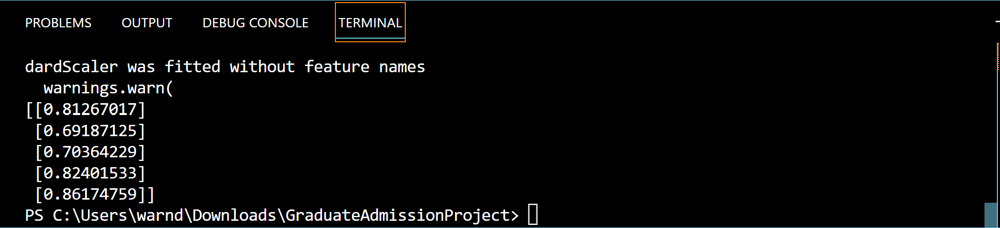

# dans_portfolio
## Bike Store Dashboard

Welcome to my Bike Store Project. This project involved creating tables to Microsoft SQL, cleaning, merging, and grouping the data. Connecting SQL to Excel to create pivot tables and an Excel dashboard.
Then finally connecting it to Tableau Public to create another more interactive dashboard. The dataset includes information about Bike store locations, Bike types, Customer names, Sales rep names, order dates, revenue, and more.

The goal was to create an easily digestible dashboard where stakeholders could get quick information about profitable stores, customers, years, bike models, and more at a glance. This is aimed to assist business operations and potentially improving sales strategies.

[Bike Store Dashboard Commit Files](https://github.com/DanWarner00/dans_portfolio)

Files In the Repository Under the "BikeStoreCommit" Include:
* BikeStores Sample Database (Creating and loading data)
* BikeStoreQuery1 (Writing code to merge and group data)
* BikeStoreDashboard.xlsx (Excel file containing pivot tables and Excel dashboard)
* BikeStoreDashboardTableau (png of Tableau Dashboard) [Tableau Dashboard Link](https://public.tableau.com/app/profile/daniel.warner8834/viz/BikeStoreDashboard_16863504991130/Dashboard1)
  

  

## College Admissions Predictor Regression

Welcome to my College Admissions Project. In this project, I had a sample dataset with hundreds of students' chances of admission based on their GRE scores, CGPAs, information on if they had done research projects, what rating the college they are applying for is (1-5), and more data involving their academic success. I also have a hypothetical dataset with the information above minus the chance of admission for 5 prospective students.

The goal of the code was to run multiple different regressions to try to find out the most accurate model to incorporate to get a prediction for the "CollegeScores" dataset that had the 5 prospective students. The models included linear regression, decision tree regression, and random forest regression.

Files In the Repository Under the "CollegeAdmissionCommit" Include:
* Admission_Predict_Ver1.1 (Sample dataset with 500 students' scores and admission %)
* CollegeScores (Information on the prospective students)
* GraduateAdmissionCode (python code used on studio visual code to test, train, and create models to predict the students' chance at admission) [Link to Code](https://github.com/DanWarner00/dans_portfolio/blob/master/GraduateAdmissionCode.py)
* StudentPredictions (Screen clipping of output for the chance of admission)

The linear regression model ended with the lowest MSE, and using that model I was able to get a prediction of the students' chance of admission to their respective schools (81.3, 69.2...)

